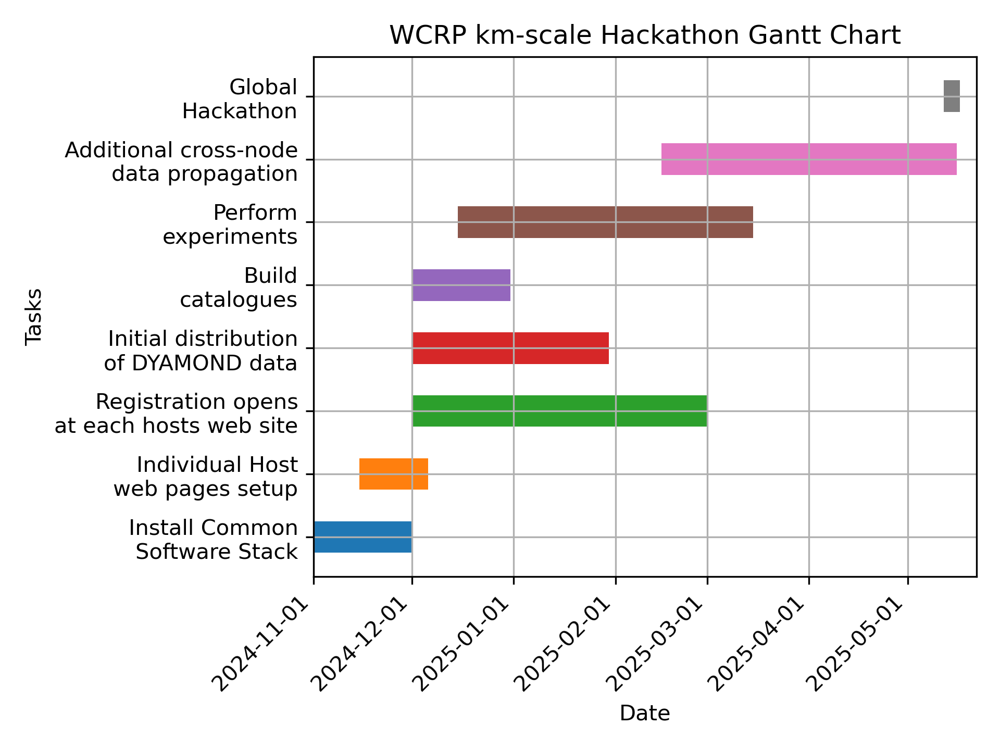

# Preparation meetings

## Meeting dates

+ 18 Nov 2024
  + Coordination issues on websites and advertising we raised at meeting with ESMO on 24 October
  + Finalizing the data request (see also the Mattermost discussion of Trackers)
  + Set up a test run and assessment of one regional HEALPix conversion
  + Handling of finances by each node individually
    + participation fees
    + stipend
  + Outreach activities (daily blog, videos, ...)
  + Streaming one presentation per day per node, ideally also recording it
+ 19 Dec 2024
+ 9  Jan 2025
+ 11  Feb 2025
+ 10 Mar 2025
+ 15 Apr 2025

## Meeting times

8:00 to 9:30 CET and repeated at 17:00 to 18:30 CET

Each meeting will cover: 
+ Steering Group topics in the first 30 minutes, and next
+ Technical Group topics.
  
### Everyone involved will receive Zoom invites with the relevant monthly links via e-mail.

## A few milestones from Oct 2024 until 12 May 2025

